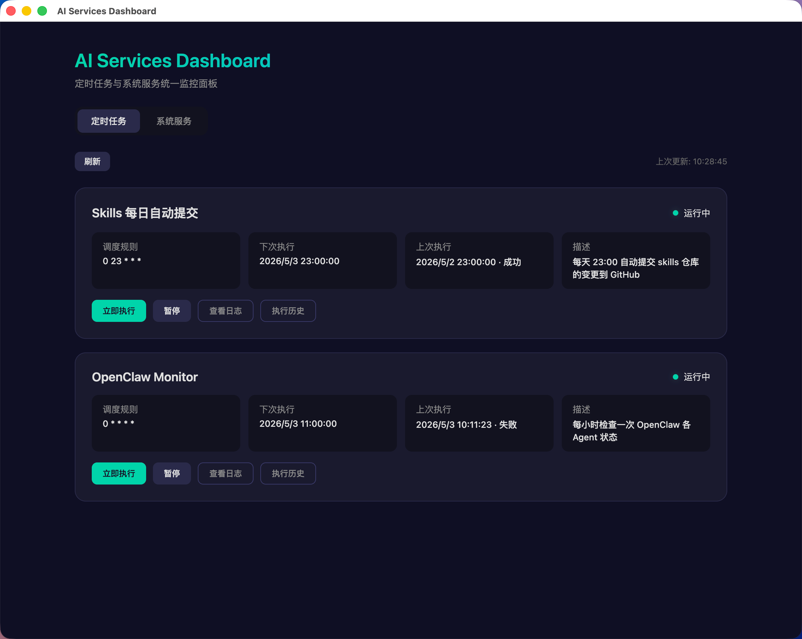
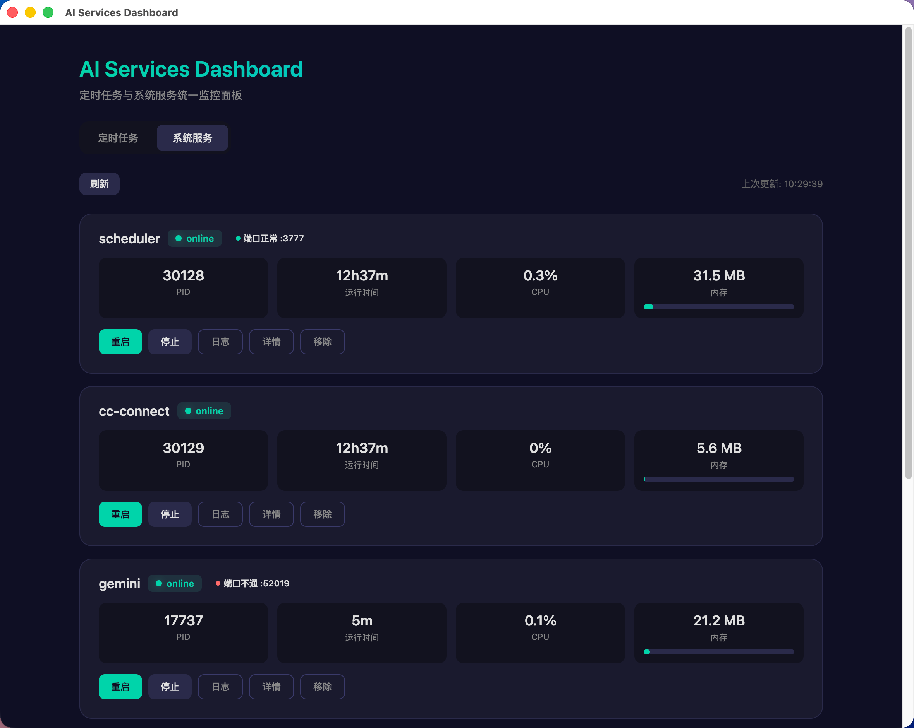
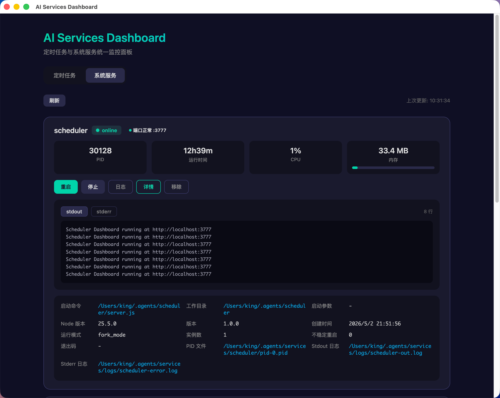
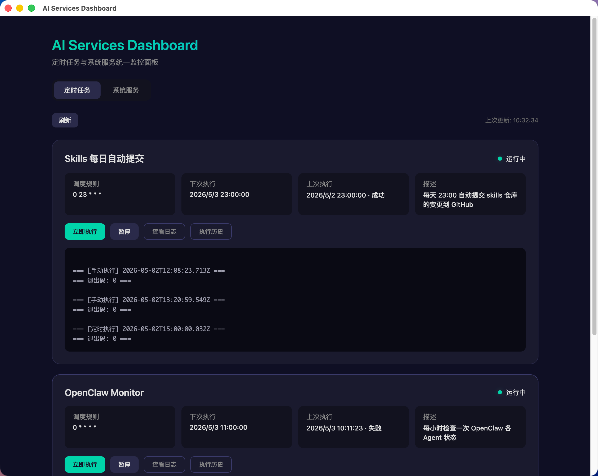

# AI Services Dashboard

> AI 服务与定时任务统一监控面板 — 一站式管理所有本地 AI 服务的健康状态、启停操作和页面看板

统一的 AI 服务监控中心，覆盖 PM2 托管服务、LaunchAgent 服务、定时任务调度、AI CLI 进程监控和 Web 页面看板，运行在原生 macOS 桌面应用中。

## 截图

| 总览面板 | 服务管理 |
|:---:|:---:|
|  |  |

| 定时任务 | 页面看板 |
|:---:|:---:|
|  |  |

## 功能特性

- **总览面板** — 一眼看全：在线/离线/异常统计，分类健康网格，异常服务快速重启，Mini 页面看板
- **侧边栏导航** — 可折叠侧边栏替代顶部标签栏，响应式适配桌面/平板/手机
- **统一服务管理** — PM2 和 LaunchAgent 服务统一卡片展示，分类过滤，一键启停重启
- **多维度健康检测** — HTTP 健康端点、TCP 端口连通、进程存活三种检测策略
- **页面看板** — iframe 嵌入本地 Web 面板，显示服务状态，支持一键重启
- **SSE 实时推送** — 服务状态变更、任务完成等事件实时推送，无需轮询
- **深色/浅色主题** — 一键切换，基于 CSS 自定义属性的设计令牌系统
- **命令面板** — Ctrl+K / Cmd+K 快速搜索服务、任务、标签页
- **Toast 通知** — 操作反馈、错误提示、连接状态等即时提醒
- **骨架屏加载** — 数据加载时展示骨架动画，避免空白闪烁
- **日志查看** — 统一日志接口，PM2 和 LaunchAgent 服务均可查看 stdout/stderr
- **定时任务** — Cron 表达式调度，手动触发、暂停/启用、执行历史
- **AI CLI 监控** — 实时追踪 Claude Code / QoderCLI 进程状态和 Context 用量
- **自动恢复** — PM2 autorestart + macOS LaunchAgent KeepAlive 双重保障
- **开机自启** — LaunchAgent + 登录项确保重启后服务自动恢复
- **原生桌面应用** — Electron 封装，无需浏览器

## 快速开始

```bash
# 克隆
git clone https://github.com/AIGoBig/ai-services-dashboard.git
cd ai-services-dashboard

# 一键部署
bash setup.sh
```

setup.sh 会：
1. 检查依赖（Node.js, npm, git）
2. 全局安装 pm2
3. 部署后端、脚本和配置到 `~/.agents/`
4. 构建 macOS 桌面应用到 `/Applications/`
5. 通过 pm2 启动所有服务
6. 将桌面应用加入 macOS 登录项

## 手动安装

```bash
# 安装依赖
npm install -g pm2

# 部署后端
mkdir -p ~/.agents/scheduler/public/css ~/.agents/scheduler/public/js ~/.agents/services/logs ~/.agents/scripts
cp server.js ~/.agents/scheduler/
cp public/index.html ~/.agents/scheduler/public/
cp -r public/css/ ~/.agents/scheduler/public/css/
cp -r public/js/ ~/.agents/scheduler/public/js/
cp config/services.json ~/.agents/scheduler/services.json

# 部署服务管理
cp services/* ~/.agents/services/
chmod +x ~/.agents/services/*.sh

# 复制任务配置（按需编辑）
cp config/tasks.example.json ~/.agents/scheduler/tasks.json

# 启动服务
cd ~/.agents/services && ./start-all.sh

# 构建桌面应用
cd dashboard-app && npm install && npm start
```

## 项目结构

```
ai-services-dashboard/
├── server.js                  # Express + node-schedule 后端
├── public/
│   ├── index.html             # 前端 SPA 入口（侧边栏 + 6 标签面板）
│   ├── css/
│   │   ├── variables.css      # 设计令牌（60+ CSS 自定义属性）
│   │   └── main.css           # 主样式（侧边栏、响应式、动画）
│   └── js/
│       ├── state.js           # 集中状态管理（Store + pub/sub）
│       ├── api.js             # API 请求层
│       ├── components.js      # DOM 工具 + 骨架屏
│       ├── toast.js           # Toast 通知
│       ├── sidebar.js         # 侧边栏导航 + 键盘快捷键
│       ├── overview.js        # 总览面板 + Mini Webview
│       ├── services.js        # 统一服务管理
│       ├── tasks.js           # 定时任务
│       ├── aicli.js           # AI CLI 进程监控
│       ├── logs.js            # Dashboard 日志
│       ├── webviews.js        # 页面看板
│       ├── app.js             # 启动入口 + SSE 实时推送
│       └── search.js          # Ctrl+K 命令面板
├── config/
│   ├── services.json          # 统一服务注册表（核心配置）
│   ├── tasks.example.json     # 定时任务模板
│   └── webviews.json          # [已废弃] 旧版 Web 页面配置
├── services/
│   ├── ecosystem.config.js    # pm2 服务定义
│   ├── start-all.sh           # 一键启动
│   ├── stop-all.sh            # 一键停止
│   └── status.sh              # 状态查看
├── dashboard-app/
│   ├── main.js                # Electron 主进程
│   ├── package.json
│   └── icon.png               # 应用图标
├── docs/
│   └── screenshots/           # 截图
├── scripts/
│   └── ai-cli-monitor.py      # AI CLI 进程检测脚本
├── setup.sh                   # 一键部署脚本
├── AGENTS.md                  # AI 代理指引
└── package.json
```

## 添加服务

编辑 `config/services.json`，按以下格式添加：

```json
{
  "id": "my-service",
  "name": "My Service",
  "manager": "pm2",
  "category": "core",
  "description": "服务描述",
  "port": 8080,
  "healthCheck": {
    "type": "http",
    "url": "http://localhost:8080/health",
    "timeout": 3000
  },
  "webview": {
    "url": "http://localhost:8080"
  }
}
```

### 字段说明

| 字段 | 必填 | 说明 |
|------|------|------|
| `id` | 是 | 唯一标识，PM2 服务需与 ecosystem.config.js 中的 name 一致 |
| `name` | 是 | 显示名称 |
| `manager` | 是 | `pm2` 或 `launchagent` |
| `category` | 是 | 分类：core / ai-cli / gateway / mcp / earn / network / monitor |
| `description` | 否 | 服务描述 |
| `port` | 否 | 主端口 |
| `launchagentLabel` | LaunchAgent 必填 | LaunchAgent 标签（如 `com.example.service`） |
| `healthCheck.type` | 否 | 健康检测类型：http / port / process / launchagent |
| `healthCheck.url` | http 类型必填 | 健康检测 URL |
| `healthCheck.timeout` | 否 | 超时毫秒数，默认 3000 |
| `webview` | 否 | 有此字段则显示在页面看板中 |
| `webview.url` | 否 | iframe 嵌入的 URL |
| `logPaths` | 非 PM2 服务建议 | 日志文件路径：`{ "stdout": "...", "stderr": "..." }` |
| `extraPorts` | 否 | 额外监控端口列表 |

### 健康检测类型

| 类型 | 说明 | 适用场景 |
|------|------|----------|
| `http` | HTTP GET 请求，2xx/3xx 为健康 | Web 服务（Dashboard、API 等） |
| `port` | TCP 端口连通性检测 | 代理服务（VPN、SOCKS 等） |
| `process` | PM2 进程状态为 online 即健康 | 无端口的 CLI 服务 |
| `launchagent` | LaunchAgent 进程存在即健康 | 系统级守护进程 |

### 分类配色

| 分类 | 标签 | 颜色 |
|------|------|------|
| `core` | 核心服务 | `#00d4aa` |
| `ai-cli` | AI CLI | `#a855f7` |
| `gateway` | 网关 | `#00a8e8` |
| `mcp` | MCP 服务 | `#f59e0b` |
| `earn` | 收益 | `#f59e0b` |
| `network` | 网络 | `#3b82f6` |
| `monitor` | 监控 | `#6b7280` |

添加后部署并重启：

```bash
cp config/services.json ~/.agents/scheduler/services.json
pm2 restart scheduler
```

配置支持热加载（10 秒内生效），也可等待自动刷新。

## 添加定时任务

编辑 `~/.agents/scheduler/tasks.json`：

```json
[
  {
    "id": "my-task",
    "name": "My Task",
    "schedule": "0 */6 * * *",
    "command": "/path/to/script.sh",
    "enabled": true,
    "description": "Runs every 6 hours"
  }
]
```

Cron 表达式：

| 表达式 | 含义 |
|--------|------|
| `0 23 * * *` | 每天 23:00 |
| `0 */6 * * *` | 每 6 小时 |
| `0 9 * * 1` | 每周一 9:00 |
| `0 0 1 * *` | 每月 1 号 |

## API 参考

### 统一服务 API

| 方法 | 路径 | 说明 |
|------|------|------|
| GET | `/api/overview` | 总览统计（在线/离线/异常，分类汇总，异常列表） |
| GET | `/api/unified-services` | 统一服务列表（含健康状态、指标、Webview 状态） |
| POST | `/api/unified-services/:id/action` | 统一操作（`{ "action": "start" \| "stop" \| "restart" }`） |
| GET | `/api/unified-services/:id/logs?type=out\|err` | 统一日志（PM2 / LaunchAgent 均支持） |
| GET | `/api/unified-services/:id/details` | 服务详情 |

### 定时任务 API

| 方法 | 路径 | 说明 |
|------|------|------|
| GET | `/api/tasks` | 任务列表（含下次执行时间、上次状态） |
| POST | `/api/tasks/:id/run` | 手动执行 |
| POST | `/api/tasks/:id/toggle` | 启用/暂停 |
| GET | `/api/tasks/:id/logs` | 任务日志 |
| GET | `/api/tasks/:id/history` | 执行历史 |

### 其他 API

| 方法 | 路径 | 说明 |
|------|------|------|
| GET | `/api/events` | SSE 实时推送（服务变更、任务完成、配置热更新等） |
| GET | `/api/ai-cli-processes` | AI CLI 进程列表及会话状态 |
| GET | `/api/dashboard-logs?source=&type=&limit=` | Dashboard 事件日志 |
| GET | `/api/services` | [旧版] PM2 服务列表 |
| GET | `/api/external-services` | [旧版] 外部服务列表 |
| GET | `/api/webviews` | [旧版] Web 页面列表 |
| GET | `/api/health` | [旧版] 端口健康检测 |

## 常用命令

```bash
# 启动所有 PM2 服务
cd ~/.agents/services && ./start-all.sh

# 停止所有
./stop-all.sh

# 查看状态
./status.sh

# PM2 命令
pm2 status                    # 列出服务
pm2 logs <name>               # 查看日志
pm2 restart <name>            # 重启
pm2 monit                     # 实时监控
pm2 save                      # 保存配置（重启后自动恢复）

# LaunchAgent 管理
launchctl list | grep pm2-services
launchctl unload ~/Library/LaunchAgents/com.qoder.pm2-services.plist
launchctl load ~/Library/LaunchAgents/com.qoder.pm2-services.plist

# 重新部署（修改源码后）
cp server.js ~/.agents/scheduler/server.js
cp public/index.html ~/.agents/scheduler/public/index.html
cp -r public/css/ ~/.agents/scheduler/public/css/
cp -r public/js/ ~/.agents/scheduler/public/js/
cp config/services.json ~/.agents/scheduler/services.json
pm2 restart scheduler
```

## 开发

```bash
# 本地开发启动后端
node server.js

# 启动 Electron 桌面应用
cd dashboard-app && npm install && npm start
```

## 技术栈

| 组件 | 技术 |
|------|------|
| 后端 | Express + node-schedule + SSE |
| 前端 | 模块化 HTML/CSS/JS（无构建步骤，13 个 JS 模块） |
| 状态管理 | 自定义 Store（pub/sub 模式） |
| 样式 | CSS 自定义属性设计令牌 + 主题系统 |
| 实时通信 | Server-Sent Events（SSE） + 60s 轮询降级 |
| 进程管理 | pm2 |
| 桌面应用 | Electron |
| 开机自启 | macOS LaunchAgent + Login Items |
| 健康检测 | HTTP / TCP / 进程存活 |

## 系统要求

- macOS 12+
- Node.js 18+
- npm

## License

MIT
