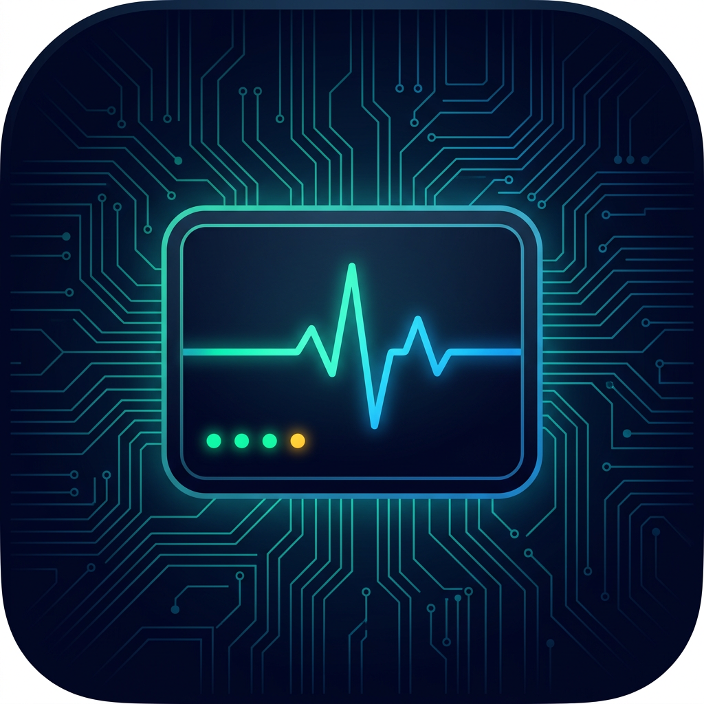

# AI Services Dashboard

> Unified dashboard for managing AI services, scheduled tasks, and system monitoring on macOS

A single pane of glass for all your local AI services — pm2-managed daemons, cron tasks, health checks, and logs — wrapped in a native macOS desktop app.



## Features

- **Service Cards** — Real-time status, PID, CPU, memory bars, port health for each service
- **Logs Viewer** — Inline stdout/stderr with one-click switching
- **Details Panel** — Exec path, working dir, version, log paths, restart count
- **Scheduled Tasks** — Cron-based task scheduler with manual trigger, pause/resume
- **Service Control** — Start / stop / restart / delete any pm2 service
- **Port Health** — TCP connectivity check for each service
- **Auto Recovery** — pm2 auto-restarts crashed services
- **Login Item** — Opens automatically on macOS login
- **Native Desktop App** — Electron-based, no browser needed

## Quick Start

```bash
# Clone
git clone https://github.com/AIGoBig/ai-services-dashboard.git
cd ai-services-dashboard

# One-click setup
bash setup.sh
```

The setup script will:
1. Check prerequisites (Node.js, npm, git)
2. Install pm2 globally
3. Deploy server, scripts, and config to `~/.agents/`
4. Build the macOS desktop app to `/Applications/`
5. Start all services via pm2
6. Add the app to macOS login items

## Manual Install

```bash
# Install dependencies
npm install -g pm2

# Deploy scheduler backend
mkdir -p ~/.agents/scheduler/public ~/.agents/services/logs ~/.agents/scripts
cp server.js ~/.agents/scheduler/
cp -r public/ ~/.agents/scheduler/public/

# Deploy service management
cp services/* ~/.agents/services/
chmod +x ~/.agents/services/*.sh

# Copy task config (edit to customize)
cp config/tasks.example.json ~/.agents/scheduler/tasks.json

# Start services
cd ~/.agents/services && ./start-all.sh

# Build desktop app
cd dashboard-app && npm install && npm start
```

## Project Structure

```
ai-services-dashboard/
├── server.js                # Express + node-schedule backend
├── public/
│   └── index.html           # Dashboard frontend (SPA)
├── services/
│   ├── ecosystem.config.js   # pm2 service definitions
│   ├── start-all.sh          # Start all services
│   ├── stop-all.sh           # Stop all services
│   └── status.sh             # Status overview
├── dashboard-app/
│   ├── main.js               # Electron main process
│   ├── package.json
│   └── icon.png              # App icon
├── config/
│   └── tasks.example.json    # Example task config
├── setup.sh                  # One-click installer
└── package.json
```

## Adding Services

Edit `~/.agents/services/ecosystem.config.js`:

```javascript
{
  name: 'my-service',
  script: '/path/to/my-service',
  cwd: '/path/to/working/dir',
  log_file: path.join(HOME, '.agents/services/logs/my-service-combined.log'),
  out_file: path.join(HOME, '.agents/services/logs/my-service-out.log'),
  error_file: path.join(HOME, '.agents/services/logs/my-service-error.log'),
  autorestart: true,
  max_restarts: 5,
  min_uptime: '10s'
}
```

Then:

```bash
cd ~/.agents/services
pm2 start ecosystem.config.js
pm2 save
```

## Adding Scheduled Tasks

Edit `~/.agents/scheduler/tasks.json`:

```json
[
  {
    "id": "my-task",
    "name": "My Task",
    "schedule": "0 */6 * * *",
    "command": "/path/to/script.sh",
    "enabled": true,
    "description": "Runs every 6 hours"
  }
]
```

Cron expressions:

| Expression | Meaning |
|-----------|---------|
| `0 23 * * *` | Daily at 23:00 |
| `0 */6 * * *` | Every 6 hours |
| `0 9 * * 1` | Every Monday at 9:00 |
| `0 0 1 * *` | First of every month |

## API Reference

| Method | Path | Description |
|--------|------|-------------|
| GET | `/api/tasks` | List scheduled tasks |
| POST | `/api/tasks/:id/run` | Manually execute task |
| POST | `/api/tasks/:id/toggle` | Enable/disable task |
| GET | `/api/tasks/:id/logs` | Get task logs |
| GET | `/api/tasks/:id/history` | Get execution history |
| GET | `/api/services` | List pm2 services |
| GET | `/api/services/:name/details` | Service full details |
| GET | `/api/services/:name/logs?type=out\|err` | Service logs |
| POST | `/api/services/:name/restart` | Restart service |
| POST | `/api/services/:name/stop` | Stop service |
| POST | `/api/services/:name/start` | Start service |
| POST | `/api/services/:name/delete` | Remove from pm2 |
| GET | `/api/health` | Port health check |

## Commands

```bash
# Start all services
cd ~/.agents/services && ./start-all.sh

# Stop all
./stop-all.sh

# View status
./status.sh

# PM2 commands
pm2 status                    # List services
pm2 logs <name>               # View logs
pm2 restart <name>            # Restart one
pm2 monit                     # Live monitor

# LaunchAgent management
launchctl list | grep pm2-services
launchctl unload ~/Library/LaunchAgents/com.qoder.pm2-services.plist
launchctl load ~/Library/LaunchAgents/com.qoder.pm2-services.plist
```

## Tech Stack

| Component | Technology |
|-----------|-----------|
| Backend | Express + node-schedule |
| Frontend | Vanilla HTML/CSS/JS |
| Process Manager | pm2 |
| Desktop App | Electron |
| Auto-start | macOS LaunchAgent + Login Items |
| Health Check | TCP port connectivity |

## Requirements

- macOS 12+
- Node.js 18+
- npm

## License

MIT
